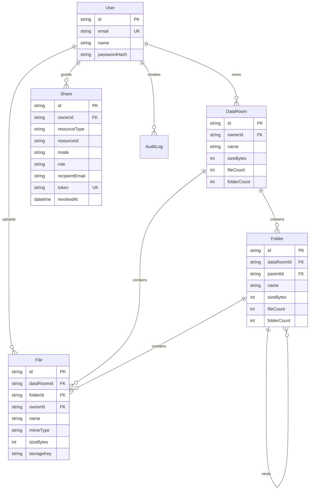

# Acme Data Room

Full-stack virtual data room MVP for acquisition due diligence. Owners can create data rooms, organize nested folders, upload and preview PDFs, rename/move/delete items, and share rooms, folders, or files as read-only resources through public links or invited-user links.

## Stack

- Web: React, TypeScript, Vite, Tailwind, lucide-react
- API: Node.js, Express, TypeScript
- Database: PostgreSQL with Prisma
- Blob storage: local blob adapter for development, S3-compatible adapter for production
- Auth: email/password with bcrypt and httpOnly JWT session cookie

## Local Setup

```bash
cp .env.example .env
cp apps/api/.env.example apps/api/.env
cp apps/web/.env.example apps/web/.env
npm install
docker compose up -d postgres
npm run db:generate
npm run db:migrate
npm run db:seed
npm run dev
```

Local URLs:

- Frontend: http://localhost:5173
- Backend: http://localhost:4000/health
- Demo owner: `founder@acme.test` / `password123`
- Demo reviewer: `reviewer@acme.test` / `password123`

Optional S3-compatible local storage:

```bash
docker compose up -d minio minio-create-bucket
```

Then set `STORAGE_DRIVER=s3` in `apps/api/.env`. MinIO console runs at http://localhost:9001.

## Functional Coverage

- Create, rename, browse, and delete nested folders with breadcrumb navigation.
- Delete preview warns with subtree folder count, file count, and size.
- Multiple PDF upload through picker or drag-and-drop.
- Per-file upload progress in the upload queue.
- Inline PDF preview and download.
- File rename with conflict suffixing, for example `Board Consent (1).pdf`.
- File move to any folder in the same room, with destination-name conflict resolution.
- File delete with blob cleanup and share revocation.
- Share data room, folder, or file as public read-only link.
- Share data room, folder, or file to a specific email as permissioned read-only link.
- Permissioned shares appear in the recipient's dashboard after sign-in.
- Owners can revoke active shares.
- Deleted shared folders/files resolve to an explicit unavailable state.

## Data Model



## Design Decisions

- Folder/file authorization is enforced on the server for every read and write route. UI affordances are convenience only.
- `Share` uses `resourceType` and `resourceId` so data rooms, folders, and files share one grant model.
- `Share.role` already exists even though this MVP only grants viewer access.
- The folder tree is adjacency-list based for simple writes and Prisma compatibility.
- `Folder` and `DataRoom` cache subtree counters (`sizeBytes`, `fileCount`, `folderCount`) so browsing and delete warnings are fast.
- Name conflicts are resolved automatically in-folder with deterministic suffixes.
- Blob bytes are outside the relational database; the DB stores searchable metadata and the blob key.
- Local blob storage is the default developer adapter. Production should set `STORAGE_DRIVER=s3` with S3, Supabase Storage S3, R2, or MinIO.

## How It Scales

How do you compute total size and item count of a folder including its whole subtree?

The app maintains denormalized counters on every folder and data room. Uploading or deleting a file increments/decrements `sizeBytes` and `fileCount` on the containing folder and each ancestor. Creating or deleting folders increments/decrements `folderCount` on ancestors. Moving a file decrements old ancestors and increments new ancestors. Reads are O(1) for totals, while writes are O(depth).

What changes when one Data Room holds 100,000 files?

The current schema already indexes `File(dataRoomId, folderId, name)`, `File(folderId, updatedAt)`, and `Folder(dataRoomId, parentId, name)`. For 100,000 files I would switch folder contents from simple limited lists to cursor pagination using `(folderId, name, id)` or `(folderId, updatedAt, id)`, add server-side sort keys, and return opaque cursors per collection. Search should move from `contains` filters to trigram/full-text indexes or a search service. Bulk deletes should enqueue blob cleanup and subtree deletion as a background job so the request can return a tracked operation.

How does sharing extend to per-user roles without remodeling?

`Share.role` is already a string field. Adding editor/commenter/uploader roles only changes policy checks in `authz.ts` and client affordances. Existing `resourceType/resourceId` grants still apply to data rooms, folders, and files. For larger teams, I would add groups and map shares to principals (`USER` or `GROUP`) while preserving the same role semantics.

## Deployment

Recommended production deployment:

- Database: Neon, Supabase Postgres, RDS, or Railway Postgres
- Blob storage: S3, Cloudflare R2, Supabase Storage S3 endpoint, or MinIO
- Backend: Render, Railway, Fly.io, or ECS
- Frontend: Vercel, Netlify, or Cloudflare Pages

Backend environment variables:

- `DATABASE_URL`
- `JWT_SECRET`
- `WEB_ORIGIN`
- `STORAGE_DRIVER=s3`
- `S3_REGION`
- `S3_BUCKET`
- `S3_ENDPOINT` when using R2/Supabase/MinIO
- `S3_ACCESS_KEY_ID`
- `S3_SECRET_ACCESS_KEY`
- `S3_FORCE_PATH_STYLE`

## AI Use

I used AI assistance to scaffold code, reason through authorization edge cases, generate seed/demo data, and draft documentation. I reviewed and adjusted the architecture, data model, naming policy, storage boundary, and user flows while building.
